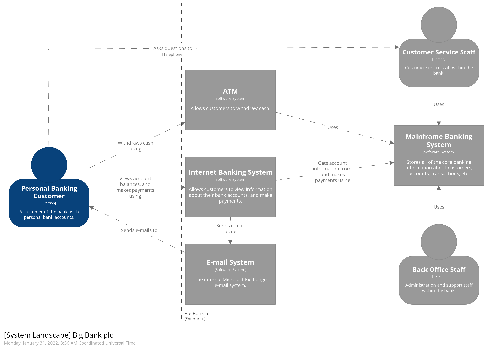
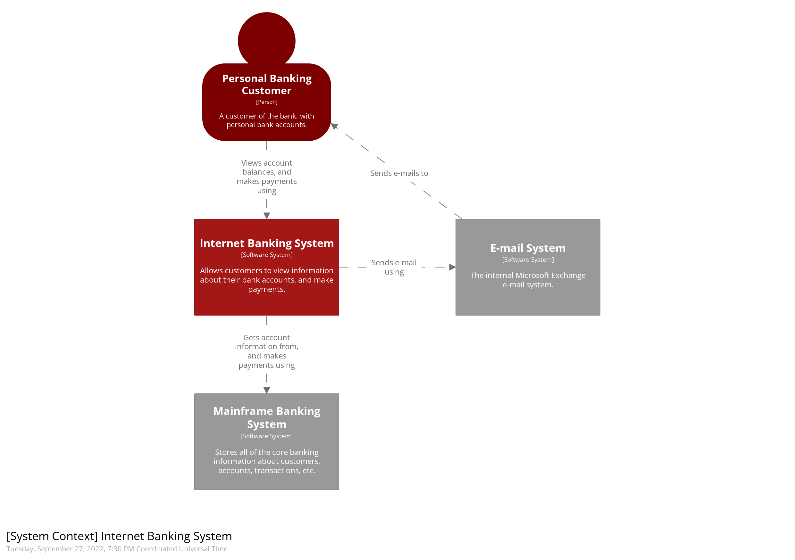
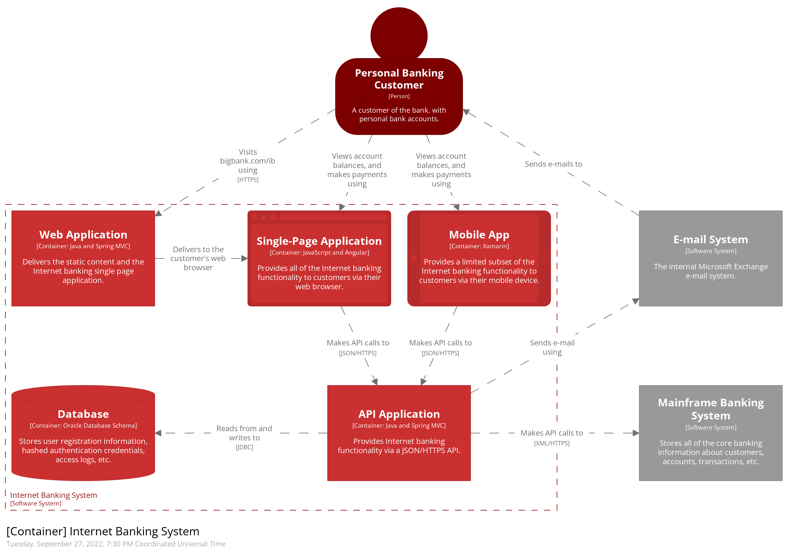
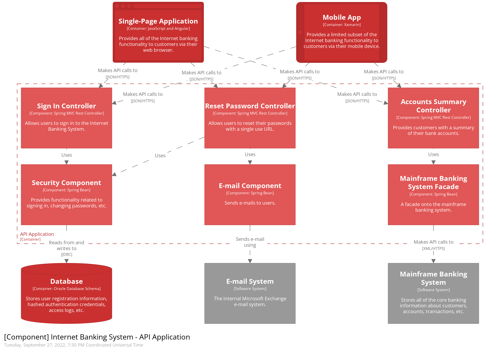
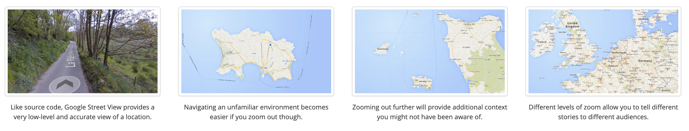

# C4 Architecture

C4 Architecture is a methodology for documenting software architectures. Using a hierarchical map like view, software is able to be communicated easily to a variety of stakeholders.

## System Landscape

A system landscape view of the whole domain of your software.

## System Context

A system level view of your software. Key notation here are **Actors** and **Software Systems**.

Recommended: Yes

## Containers

A containerised view of your software system. Key details here are anything that executes code or stores data.

e.g **Database**, **API**, **UI** 

Recommended: Yes

## Components

A Component is a singular entity within a Container. A Container can have **multiple** Components. A component in these cases are controllers/Objects in a UML sense. These are likely to go out of date quickly are therefore recommended to be auto generated by the code.

Recommended: No

## Code

Code is only relevant for very important or complex components. Therefore I have decided to leave it from this document 

Recommended: No

## Maps of your code

### Key Metrics of a software Development team

- Delivery lead time
    
    The time it takes from code being committed to code running in production

- Deployment frequency

    High frequency of deployments is also linked to much smaller deployments. Smaller deployments are easier to rollback and safer to deploy

- Change failure rate

    Where production has been impaired by a deployment and required a rollback or fix-forward to remediate  

- Mean time to recovery

    The recovery time of your software in the event of a deployment failure

### Resources

https://backstage.io/docs/features/software-catalog/system-model

https://c4model.com/ 