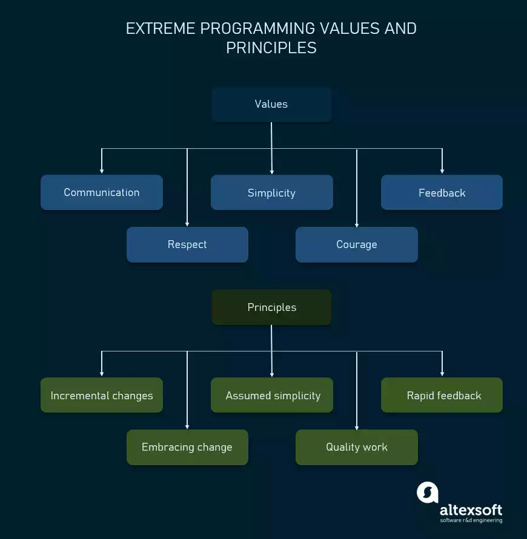
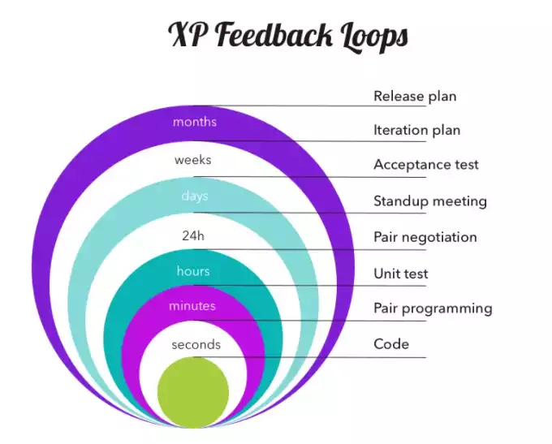
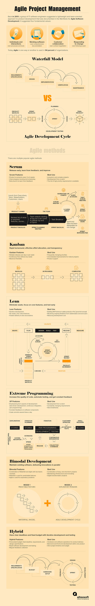

# Extreme Programming

5 Stages of Extreme Programming
```
Planning -> Designing -> Coding -> Testing -> Listening
```




## Planning
In this stage the requirements are gathered from the **Customer** and translated into **user stories**. Based on these **user stories**, the team will **estimate** duration in a **release plan**. This is the time taken to deliver and aspects of the requirements.

If an feature cannot be **estimated**, a **spike** can be introduced to commence further research.

## Designing

A good design emphasises **simplicity**. Design is actually part of the **planning** process but has its own stage to emphasise its importance.

## Coding
This is where **user stories** are translated into **code**. Extreme programming incorporates **pair programming**, **continuous integration** and collective **code ownership**. It champions **Test Driven Development**, **Refactoring**, **small releases** and **simple design**. 

## Testing

Testing is a regular activity in **extreme programming**. It heavily utilises **unit tests**, aswell as **acceptance tests**. Testing is critical part of **extreme programming** and is at the heart of the practice.

## Listening

Listening is all about constant **communication** and **feedback**. **feedback** allows for better **iteration** on a product. 








