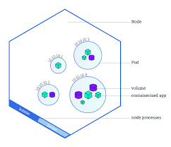
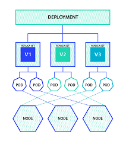
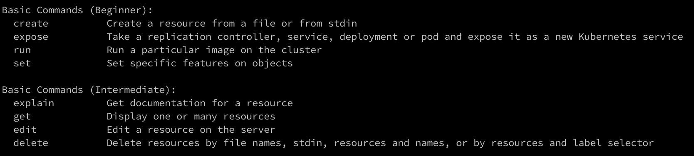
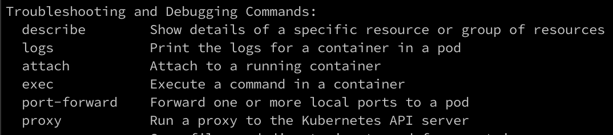

# Kubernetes


## What is kubernetes?

Kubernetes is a platform for managing containerized applications. It provides a framework to manage containers; offering scalability, resiliance, orchestration and more. If a container goes down, Kubernetes can start it back up automatically. If an application can run in a container, it should run great in kubernetes. 


## Key Aspects of Kubenetes:


### Pod
A ```pod``` of Whales (Docker). A group of one or more containers with shared storage and network resources.




```kubectl get pods``` - Gets all the pods within the cluster
```kubectl describe pods``` - Describes information about the pods


https://kubernetes.io/docs/concepts/workloads/pods/ 

### Service
A network service that abstracts over pods. Pods have their own IP addresses. A service can be a single DNS across a set of pods and can 
load balance between them


```kubectl get services``` - Gets all the services with the cluster 
```kubectl describe services``` - Describes information about the service 

https://kubernetes.io/docs/concepts/services-networking/service/


### Deployment
A deployment provides declarative updates for pods and replicaSets




```kubectl get deployments``` - Gets all the deployments 
```kubectl describe deployments``` - Describes information on all of the deployments 


## Interacting with a cluster:

```kubectl``` is the command line interface. It abstracts the kubernetes API and allows interaction with the kubenetes cluster.


Basic ```kubectl``` usage:
<br>


Basic Troubleshooting ```kubectl``` usage:
<br>



https://kubernetes.io/docs/concepts/workloads/controllers/deployment/


Reflection:

How well do I understand this technology?

3/10


How innovative could I be with this technology?

2/10